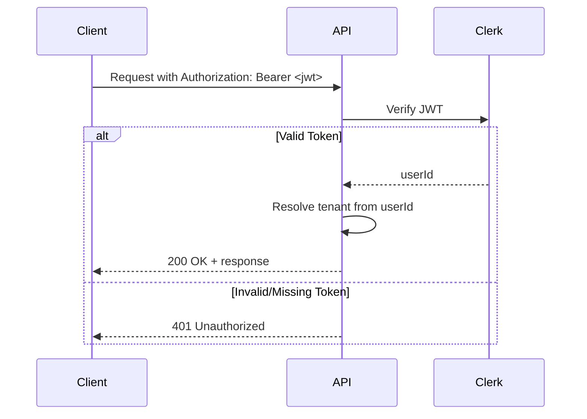
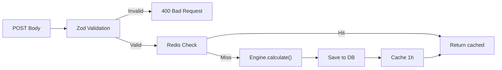
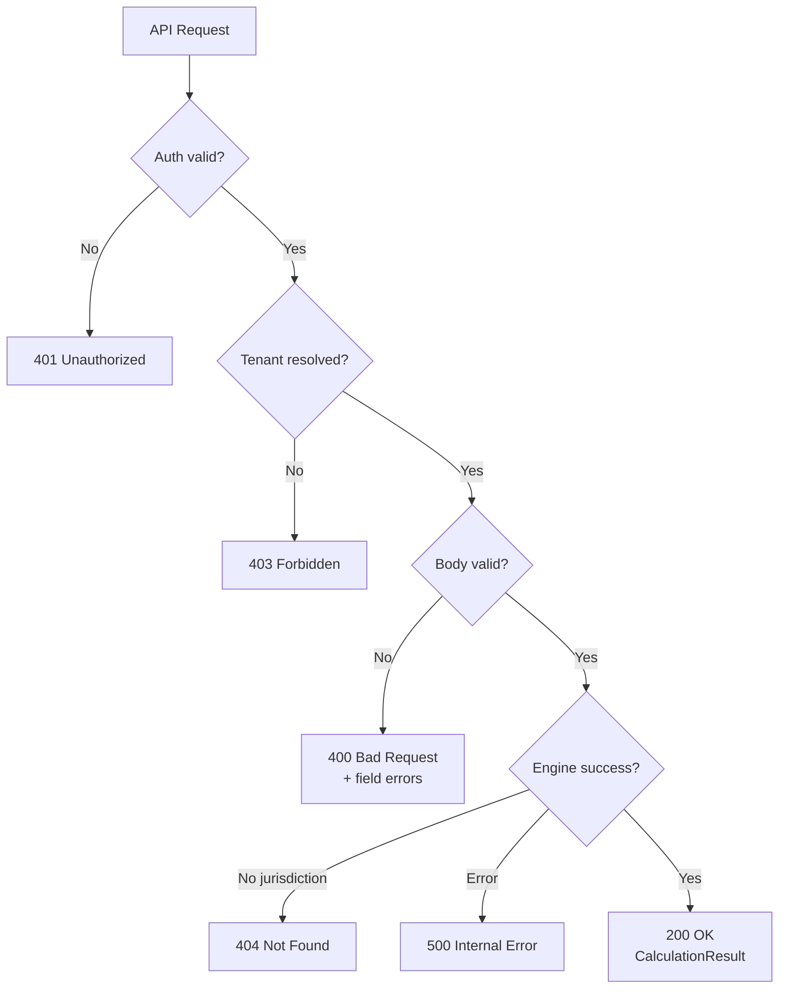

# API Reference

**Base URL:** `http://localhost:4000` (development) | `https://api.your-domain.com` (production)

All endpoints require authentication via Clerk JWT token in the `Authorization` header.

---

## Table of Contents

- [Authentication](#authentication)
- [Endpoints](#endpoints)
  - [POST /api/v1/tax/calculate](#post-apiv1taxcalculate)
  - [GET /api/v1/tax/history](#get-apiv1taxhistory)
- [Data Types](#data-types)
- [Error Handling](#error-handling)
- [Validation Rules](#validation-rules)

---

## Authentication



### Headers

```
Authorization: Bearer <clerk-jwt-token>
Content-Type: application/json
```

The JWT is obtained from the Clerk frontend SDK (`useAuth()` hook) and automatically includes the user's identity. The API resolves the tenant (organization, country) from the authenticated user's profile.

---

## Endpoints

### POST /api/v1/tax/calculate

Calculate taxes and subsidies for the authenticated user's organization.

#### Request Flow



#### Request Body

```json
{
  "fiscalYear": 2026,
  "co2Tonnes": 1000,
  "revenue": 5000000,
  "employeeCount": 30,
  "energyConsumptionKwh": 400000,
  "renewableEnergyPercent": 40,
  "emissionsByScope": {
    "SCOPE_1": 600,
    "SCOPE_2": 300,
    "SCOPE_3": 100
  },
  "metadata": {
    "solarCapacityKWp": 20,
    "selfConsumptionRatio": 0.60,
    "evCount": 3,
    "evConsumptionKWhPer100km": 15,
    "evCountVans": 2,
    "wallboxCount": 2,
    "wallboxSmartCharging": true,
    "sustainabilityAuditExpense": 30000
  }
}
```

#### Request Schema (Zod)

| Field | Type | Required | Constraints |
|-------|------|----------|-------------|
| `fiscalYear` | integer | Yes | 2020-2100 |
| `co2Tonnes` | number | Yes | >= 0 |
| `revenue` | number | Yes | >= 0 |
| `employeeCount` | integer | Yes | >= 0 |
| `energyConsumptionKwh` | number | Yes | >= 0 |
| `renewableEnergyPercent` | number | Yes | 0-100 |
| `emissionsByScope` | object | Yes | SCOPE_1, SCOPE_2, SCOPE_3 (all >= 0) |
| `metadata` | object | No | Arbitrary key-value pairs |

#### Metadata Fields by Country

##### Luxembourg (LU)

| Field | Type | Description |
|-------|------|-------------|
| `solarCapacityKWp` | number | Installed PV capacity in kWp |
| `selfConsumptionRatio` | number | 0-1, ratio of self-consumed PV energy |
| `evCount` | integer | Number of electric vehicles |
| `evConsumptionKWhPer100km` | number | EV consumption for prime eligibility |
| `wallboxCount` | integer | Number of charging stations |
| `wallboxSmartCharging` | boolean | Smart charging bonus |
| `sustainabilityAuditExpense` | number | Fit4Sustainability audit costs in EUR |

##### France (FR)

| Field | Type | Description |
|-------|------|-------------|
| `solarCapacityKWp` | number | Installed PV capacity in kWp |
| `selfConsumptionRatio` | number | 0-1, ratio of self-consumed PV energy |
| `evCount` | integer | Number of passenger EVs (VP) |
| `evCountVans` | integer | Number of electric vans (VUL) |
| `sustainabilityAuditExpense` | number | ADEME decarbonation costs in EUR |

#### Response (200 OK)

```json
{
  "organizationId": "550e8400-e29b-41d4-a716-446655440000",
  "countryCode": "FR",
  "fiscalYear": 2026,
  "calculatedAt": "2026-02-12T14:30:00.000Z",
  "currency": "EUR",
  "lineItems": [
    {
      "code": "FR-CCE-2026",
      "label": "Contribution Climat Energie (CCE)",
      "amount": -44600,
      "currency": "EUR",
      "description": "1000t CO2 x 44.60 EUR/t = 44600 EUR",
      "legalReference": "Art. 265 du Code des douanes"
    },
    {
      "code": "FR-IS-2026",
      "label": "Impot sur les Societes + CVAE",
      "amount": -129875,
      "currency": "EUR",
      "description": "PME: 15% sur 42500 EUR + 25% surplus + CVAE 0.09%",
      "legalReference": "Art. 219 CGI"
    },
    {
      "code": "FR-PV-PRIME-2026",
      "label": "Prime Autoconsommation PV",
      "amount": 2260,
      "currency": "EUR",
      "description": "Prime degressive: 9 kWp x 80 EUR + 11 kWp x 140 EUR",
      "legalReference": "Arrete tarifaire S21"
    },
    {
      "code": "FR-BONUS-ECO-2026",
      "label": "Bonus Ecologique Entreprises",
      "amount": 17000,
      "currency": "EUR",
      "description": "3 VP x 3000 EUR + 2 VUL x 4000 EUR",
      "legalReference": "Decret bonus ecologique"
    },
    {
      "code": "FR-ADEME-TREMPLIN-2026",
      "label": "ADEME Tremplin",
      "amount": 15000,
      "currency": "EUR",
      "description": "TPE/PE: 50% de 30000 EUR",
      "legalReference": "ADEME Tremplin"
    },
    {
      "code": "FR-ENERGY-SAVINGS-2026",
      "label": "Economies energie PV (estimation annuelle)",
      "amount": 3639.68,
      "currency": "EUR",
      "description": "22000 kWh/an estimes",
      "legalReference": "Tarif d'achat EDF OA Solaire 2026"
    }
  ],
  "netAmount": -136575.32,
  "engineVersion": "0.1.0"
}
```

#### Response Fields

| Field | Type | Description |
|-------|------|-------------|
| `organizationId` | UUID | Tenant organization |
| `countryCode` | string | ISO 3166-1 alpha-2 |
| `fiscalYear` | integer | Calculation year |
| `calculatedAt` | ISO date | Timestamp |
| `currency` | string | ISO 4217 |
| `lineItems` | array | Individual tax/subsidy items |
| `lineItems[].code` | string | Unique code (e.g. `FR-CCE-2026`) |
| `lineItems[].amount` | number | Positive = subsidy, Negative = tax |
| `lineItems[].legalReference` | string? | Legal basis |
| `netAmount` | number | Sum of all line items |
| `engineVersion` | string | Engine version |

---

### GET /api/v1/tax/history

Retrieve calculation history for the authenticated user's organization.

#### Query Parameters

| Parameter | Type | Default | Description |
|-----------|------|---------|-------------|
| `limit` | integer | 20 | Max results to return |

#### Request

```
GET /api/v1/tax/history?limit=10
Authorization: Bearer <jwt>
```

#### Response (200 OK)

```json
[
  {
    "id": "00000000-0000-0000-0000-000000000100",
    "organizationId": "00000000-0000-0000-0000-000000000001",
    "countryCode": "LU",
    "fiscalYear": 2026,
    "input": { ... },
    "result": { ... },
    "netAmount": -16000,
    "currency": "EUR",
    "engineVersion": "0.1.0",
    "createdAt": "2026-02-12T10:00:00.000Z"
  }
]
```

Results are ordered by `createdAt` descending (most recent first).

---

## Data Types

### Line Item Codes

#### Luxembourg (LU)

| Code | Type | Module |
|------|------|--------|
| `LU-CO2-TAX-2026` | Tax | Progressive CO2 tax (4 brackets) |
| `LU-CORP-TAX-2026` | Tax | IRC + Taxe Commerciale |
| `LU-KB-PV-2026` | Subsidy | Klimabonus Photovoltaique |
| `LU-KB-EV-2026` | Subsidy | Prime Vehicule Electrique |
| `LU-KB-WALLBOX-2026` | Subsidy | Prime Borne de Recharge |
| `LU-F4S-2026` | Subsidy | Fit 4 Sustainability |
| `LU-ENERGY-SAVINGS-2026` | Savings | PV energy savings estimate |

#### France (FR)

| Code | Type | Module |
|------|------|--------|
| `FR-CCE-2026` | Tax | Contribution Climat Energie |
| `FR-IS-2026` | Tax | IS + CVAE |
| `FR-PV-PRIME-2026` | Subsidy | Prime Autoconsommation PV |
| `FR-BONUS-ECO-2026` | Subsidy | Bonus Ecologique |
| `FR-ADEME-TREMPLIN-2026` | Subsidy | ADEME Tremplin |
| `FR-ENERGY-SAVINGS-2026` | Savings | PV energy savings estimate |

### Emission Scopes (GHG Protocol)

| Scope | Description |
|-------|-------------|
| `SCOPE_1` | Direct emissions from owned/controlled sources |
| `SCOPE_2` | Indirect emissions from purchased energy |
| `SCOPE_3` | All other indirect value chain emissions |

### Enterprise Types

| Type | Criteria |
|------|----------|
| `SMALL_ENTERPRISE` | <= 50 employees AND <= 10M EUR revenue |
| `MEDIUM_ENTERPRISE` | <= 250 employees AND <= 50M EUR revenue |
| `LARGE_ENTERPRISE` | > 250 employees OR > 50M EUR revenue |

---

## Error Handling

### Error Response Format

```json
{
  "statusCode": 400,
  "message": "Validation failed",
  "errors": [
    {
      "field": "co2Tonnes",
      "message": "Number must be greater than or equal to 0"
    }
  ]
}
```

### HTTP Status Codes

| Code | Meaning | Common Cause |
|------|---------|-------------|
| `200` | Success | Calculation complete |
| `400` | Bad Request | Zod validation failure |
| `401` | Unauthorized | Missing/invalid JWT |
| `403` | Forbidden | User not in organization |
| `404` | Not Found | Unsupported jurisdiction |
| `429` | Rate Limited | Too many requests |
| `500` | Internal Error | Engine or database failure |



---

## Validation Rules

### Input Validation (Zod)

```
fiscalYear:              integer, 2020-2100
co2Tonnes:               number, >= 0
revenue:                 number, >= 0
employeeCount:           integer, >= 0
energyConsumptionKwh:    number, >= 0
renewableEnergyPercent:  number, 0-100
emissionsByScope.SCOPE_1: number, >= 0
emissionsByScope.SCOPE_2: number, >= 0
emissionsByScope.SCOPE_3: number, >= 0
metadata:                object (optional), arbitrary key-value
```

### Country Code

- Must be exactly 2 characters
- Automatically uppercased
- Must match a registered strategy for the given fiscal year

---

## cURL Examples

### Calculate (Luxembourg)

```bash
curl -X POST http://localhost:4000/api/v1/tax/calculate \
  -H "Authorization: Bearer $CLERK_JWT" \
  -H "Content-Type: application/json" \
  -d '{
    "fiscalYear": 2026,
    "co2Tonnes": 1200,
    "revenue": 8000000,
    "employeeCount": 45,
    "energyConsumptionKwh": 350000,
    "renewableEnergyPercent": 65,
    "emissionsByScope": {
      "SCOPE_1": 720,
      "SCOPE_2": 360,
      "SCOPE_3": 120
    },
    "metadata": {
      "solarCapacityKWp": 20,
      "selfConsumptionRatio": 0.60,
      "evCount": 3,
      "evConsumptionKWhPer100km": 15,
      "wallboxCount": 2,
      "wallboxSmartCharging": true,
      "sustainabilityAuditExpense": 30000
    }
  }'
```

### Get History

```bash
curl http://localhost:4000/api/v1/tax/history?limit=5 \
  -H "Authorization: Bearer $CLERK_JWT"
```

---

## Rate Limiting & Caching

### Cache Behavior

- **Key format:** `calc:{organizationId}:{countryCode}:{fiscalYear}`
- **TTL:** 3600 seconds (1 hour)
- **Eviction:** `allkeys-lru` when Redis exceeds 256MB
- Cache is **per-organization**, not per-user
- Changing input parameters does not invalidate cache automatically (cache is based on org + country + year)

### Recommended Client Usage

1. Use the **client-side engine** (`simulateLocally()`) for real-time preview
2. Call the API only when **saving** or **persisting** a calculation
3. Use the **history endpoint** for retrieving past calculations
