# Architecture Guide

## Table of Contents

- [System Overview](#system-overview)
- [Economic Model](#economic-model)
- [Monorepo Structure](#monorepo-structure)
- [Calculation Engine](#calculation-engine)
- [Strategy Pattern](#strategy-pattern)
- [Data Flow](#data-flow)
- [Multi-Tenancy](#multi-tenancy)
- [Subscription & Quota Management](#subscription--quota-management)
- [Authentication & Authorization](#authentication--authorization)
- [Caching Strategy](#caching-strategy)
- [Client-Side Engine](#client-side-engine)
- [PDF Report Generation](#pdf-report-generation)
- [Adding a New Jurisdiction](#adding-a-new-jurisdiction)

---

## System Overview

Global Green Tax is a SaaS platform that calculates carbon taxes and green subsidies across multiple jurisdictions. The system follows a **Strategy Pattern** where each country/year combination is an independent, pluggable module.

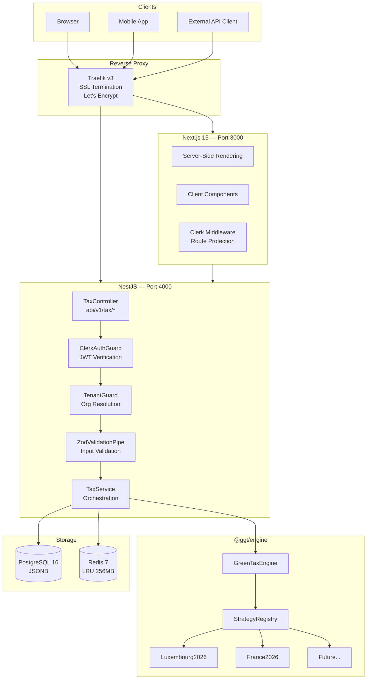

---

## Economic Model

Global Green Tax follows a **tiered SaaS subscription model** with three plans designed to capture value across the full spectrum of enterprise sizes.

### Plan Comparison

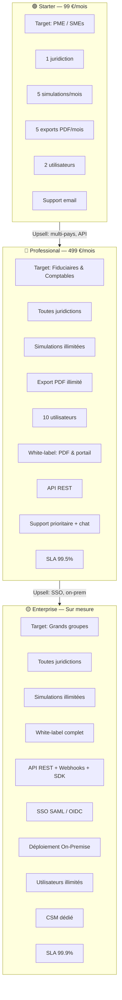

### Detailed Feature Matrix

| Feature | Starter (99 €/mois) | Professional (499 €/mois) | Enterprise (Custom) |
|---------|---------------------|---------------------------|---------------------|
| **Jurisdictions** | 1 pays | Tous les pays | Tous les pays |
| **Simulations** | 5 / mois | Illimité | Illimité |
| **Export PDF** | 5 / mois | Illimité | Illimité |
| **Utilisateurs** | 2 sièges | 10 sièges | Illimité |
| **White-label** | — | PDF & portail brandé | White-label complet |
| **API Access** | — | REST API | REST + Webhooks + SDK |
| **SSO** | — | — | SAML / OIDC |
| **Support** | Email (48h) | Email + chat prioritaire | CSM dédié |
| **SLA** | — | 99.5% uptime | 99.9% + SLA custom |
| **Déploiement** | Cloud mutualisé | Cloud | Cloud / On-premise |
| **Historique** | 3 mois | 24 mois | Illimité |
| **Audit trail** | — | Logs d'accès | Logs complets + SIEM |

### Subscription Lifecycle

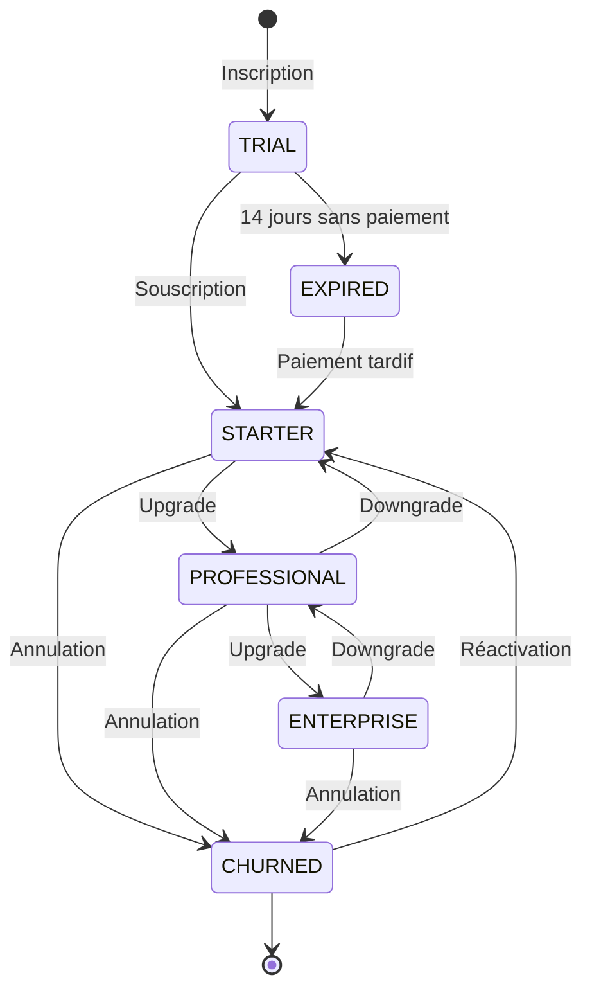

### Quota Enforcement Architecture

The platform enforces subscription quotas via a `SubscriptionGuard` in the NestJS API pipeline:

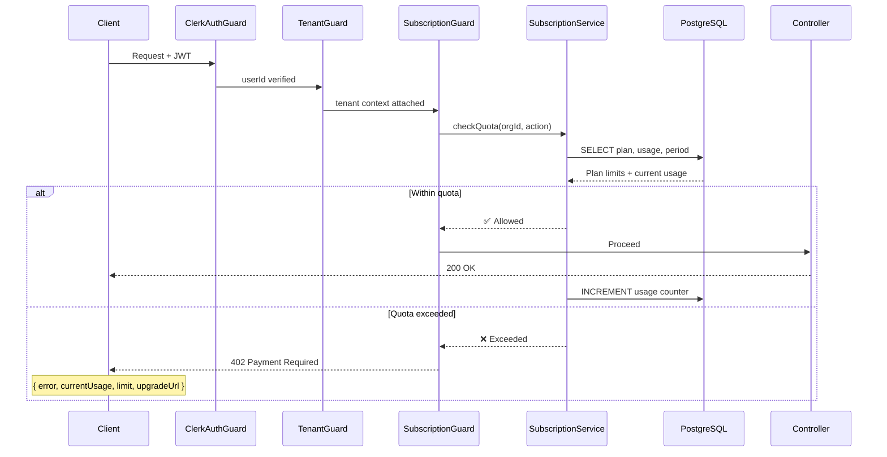

### Revenue Model

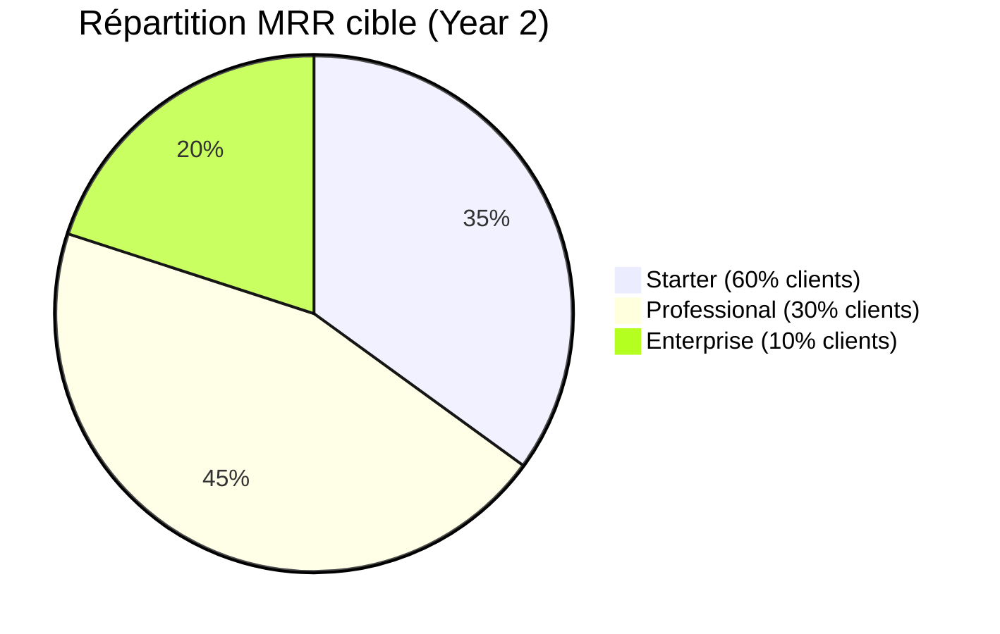

| Metric | Target |
|--------|--------|
| **MRR per Starter** | 99 € |
| **MRR per Professional** | 499 € |
| **ACV Enterprise** | 15 000 – 50 000 € |
| **Taux de churn** | < 5% mensuel |
| **Ratio LTV/CAC** | > 3:1 |
| **Marge brute** | > 85% (pure SaaS) |
| **Conversion trial → paid** | > 15% |

---

## Monorepo Structure

The project uses **Turborepo** with npm workspaces for build orchestration:

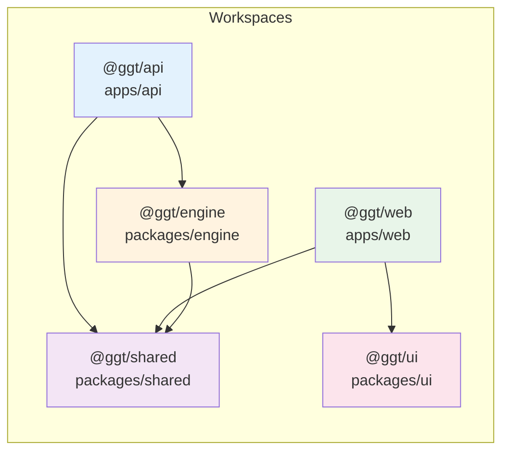

### Turborepo Pipeline

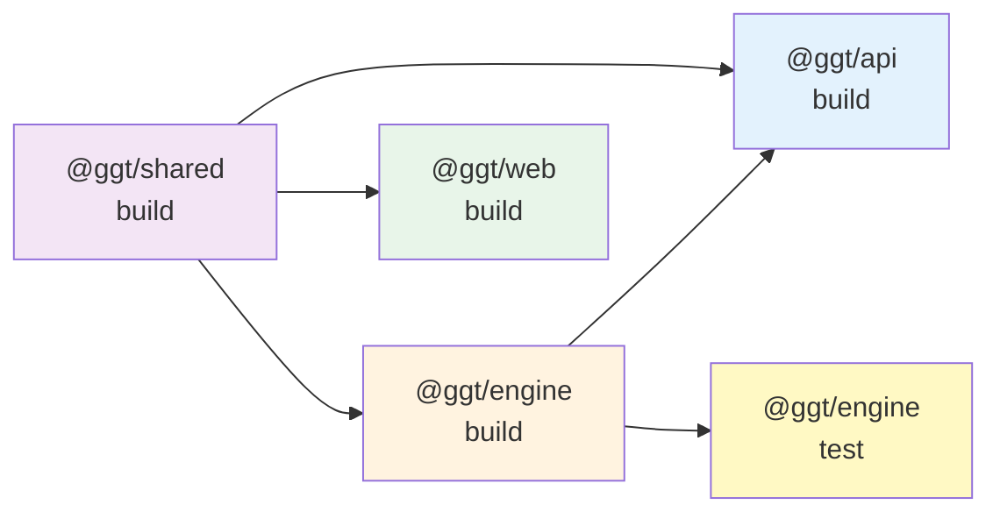

**Key packages:**

| Package | Role | Dependencies |
|---------|------|-------------|
| `@ggt/shared` | Types, Zod schemas, enums | None |
| `@ggt/engine` | Calculation engine, strategies | `@ggt/shared` |
| `@ggt/api` | REST API, auth, DB, cache | `@ggt/engine`, `@ggt/shared` |
| `@ggt/web` | Frontend, simulation UI, PDF | `@ggt/shared` |
| `@ggt/ui` | Shared UI utilities | None |

---

## Calculation Engine

The engine is a pure TypeScript package with zero framework dependencies. This enables it to run server-side (NestJS) and client-side (browser) identically.

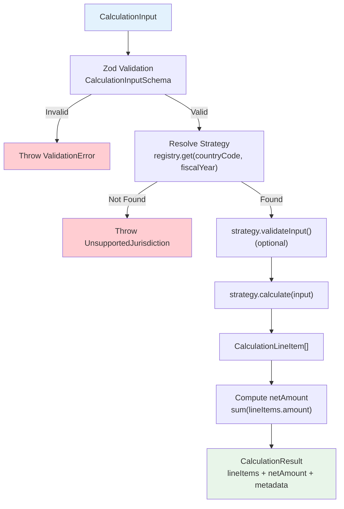

### Line Item Convention

Every calculation produces an array of `CalculationLineItem`:

| Field | Description |
|-------|-------------|
| `code` | Unique identifier (e.g., `FR-CCE-2026`) |
| `label` | Human-readable name |
| `amount` | **Positive** = subsidy/credit, **Negative** = tax/levy |
| `currency` | ISO 4217 code |
| `description` | Calculation breakdown |
| `legalReference` | Legal basis (optional) |

---

## Strategy Pattern

Each jurisdiction implements the `JurisdictionStrategy` interface:

```typescript
interface JurisdictionStrategy {
  readonly countryCode: string;
  readonly name: string;
  readonly fiscalYear: number;
  readonly currency: CurrencyCode;
  calculate(input: CalculationInput): Promise<CalculationLineItem[]>;
  validateInput?(input: CalculationInput): void;
}
```

### Strategy Registry

Strategies are stored in a map keyed by `{countryCode}:{fiscalYear}`:

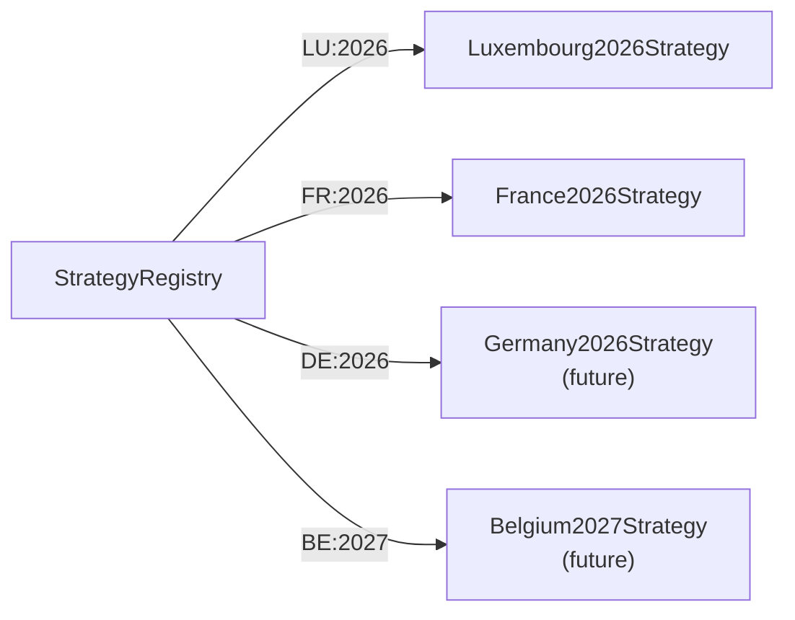

### Luxembourg 2026 Calculation Flow

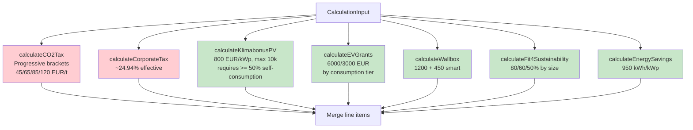

### France 2026 Calculation Flow

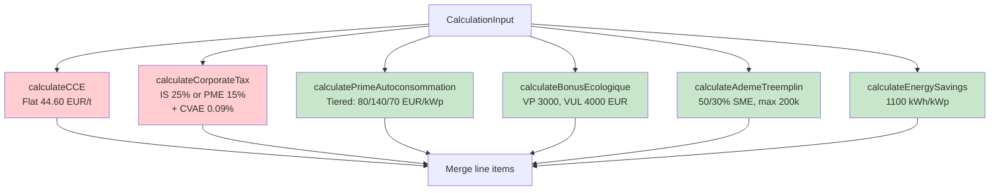

### Enterprise Size Classification

Both strategies classify organizations by size, affecting subsidy rates:

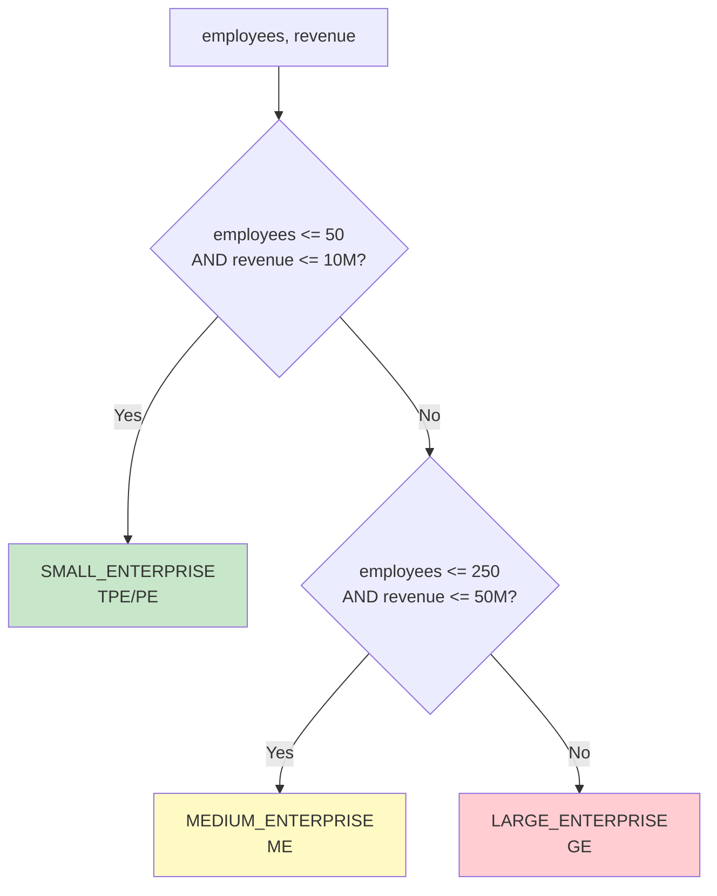

---

## Data Flow

### Calculation Pipeline (Server-Side)

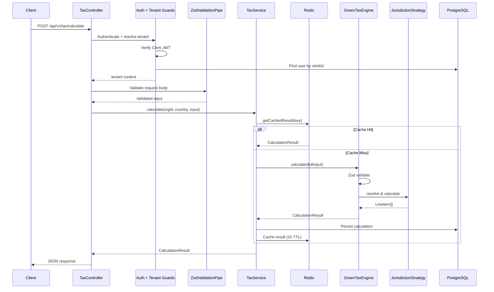

---

## Multi-Tenancy

The application implements **row-level multi-tenancy** through the `TenantGuard`:

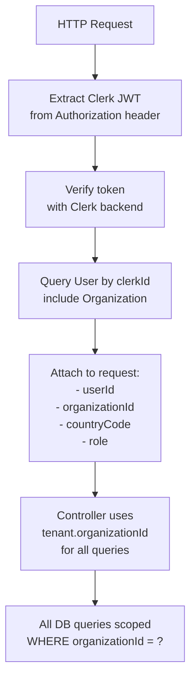

### Role-Based Access

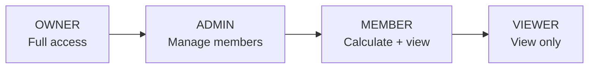

---

## Subscription & Quota Management

The `SubscriptionModule` manages plan assignments, usage tracking, and quota enforcement for all organizations.

### Data Model

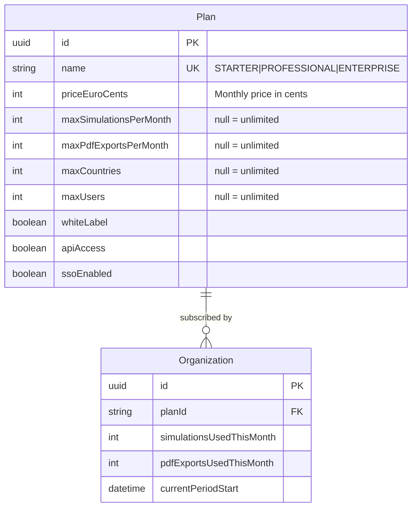

### SubscriptionService API

```typescript
class SubscriptionService {
  // Query
  getOrganizationPlan(orgId: string): Promise<PlanWithUsage>

  // Quota checks (called by guard)
  checkSimulationQuota(orgId: string): Promise<QuotaCheckResult>
  checkPdfExportQuota(orgId: string): Promise<QuotaCheckResult>

  // Usage tracking (called after successful action)
  incrementSimulationUsage(orgId: string): Promise<void>
  incrementPdfExportUsage(orgId: string): Promise<void>

  // Plan management
  changePlan(orgId: string, planName: string): Promise<Organization>
  resetMonthlyUsage(): Promise<void>  // CRON: 1st of each month
}
```

### Quota Reset Flow

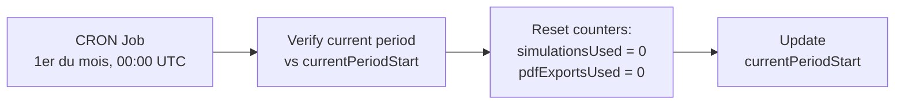

---

## Caching Strategy

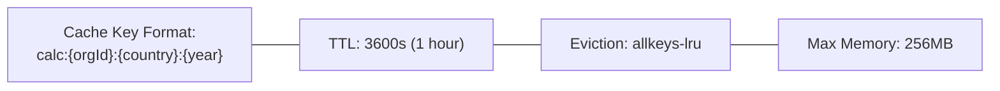

The `RedisService` provides:
- `buildCacheKey(orgId, countryCode, fiscalYear)` - Deterministic key generation
- `cacheResult(key, value, ttl)` - Store with TTL
- `getCachedResult<T>(key)` - Retrieve typed result
- `invalidate(key)` - Manual cache bust

---

## Client-Side Engine

The frontend includes a **mirror calculation engine** (`engine-client.ts`) that runs entirely in the browser for instant UI feedback:

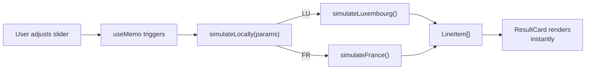

This dual-engine approach provides:
- **Zero latency** during parameter adjustment
- **No API calls** needed for preview
- **Identical logic** to server-side engine
- Server-side engine is the **source of truth** for persistence

---

## PDF Report Generation

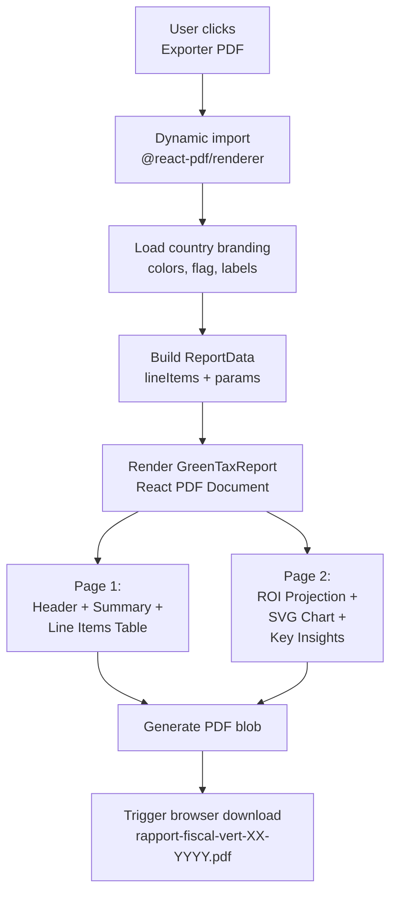

### Country Branding

| Element | Luxembourg | France |
|---------|-----------|--------|
| Header BG | `#1A4D8F` (blue) | `#002395` (bleu) |
| Accent | `#D71A28` (red) | `#ED2939` (rouge) |
| Flag | Red/White/Blue | Blue/White/Red |
| Tax color | `#D71A28` | `#ED2939` |
| Subsidy color | `#1A8D5F` | `#1A8D5F` |

---

## Adding a New Jurisdiction

### Step-by-step walkthrough

#### 1. Create the data schema

Copy `data/schemas/_template.json` as `{CODE}-{YEAR}.json`:

```json
{
  "metadata": {
    "countryCode": "DE",
    "countryName": "Germany",
    "fiscalYear": 2026,
    "currency": "EUR",
    "lastUpdated": "2026-01-01"
  },
  "taxRules": { ... },
  "subsidies": { ... },
  "energyRates": { ... }
}
```

#### 2. Create the strategy class

Create `packages/engine/src/strategies/germany-2026.ts`:

```typescript
import type { CalculationInput, CalculationLineItem } from '@ggt/shared';
import type { JurisdictionStrategy } from '../jurisdiction-strategy';

export class Germany2026Strategy implements JurisdictionStrategy {
  readonly countryCode = 'DE';
  readonly name = 'Germany 2026';
  readonly fiscalYear = 2026;
  readonly currency = 'EUR' as const;

  async calculate(input: CalculationInput): Promise<CalculationLineItem[]> {
    const items: CalculationLineItem[] = [];
    // Implement German-specific calculations
    return items;
  }
}
```

#### 3. Register the strategy

Update `packages/engine/src/index.ts`:

```typescript
export { Germany2026Strategy } from './strategies/germany-2026';
```

Update `apps/api/src/modules/tax/tax.service.ts`:

```typescript
registry.register(new Germany2026Strategy());
```

#### 4. Add client-side engine

Update `apps/web/src/lib/engine-client.ts`:

```typescript
export type CountryCode = 'LU' | 'FR' | 'DE';

// In simulateLocally():
case 'DE': return simulateGermany(params);
```

#### 5. Update frontend & branding

Add to `COUNTRIES` array in `page.tsx`, add branding in `pdf/country-branding.ts`.

#### 6. Update seed & tests

- Add data loading in `apps/api/prisma/seed.ts`
- Create test suite in `packages/engine/src/__tests__/germany-2026.test.ts`

### Verification checklist

```mermaid
flowchart LR
    A["JSON schema<br/>created"] --> B["Strategy class<br/>implements interface"]
    B --> C["Engine exports<br/>updated"]
    C --> D["API registry<br/>registers strategy"]
    D --> E["Client engine<br/>dispatches"]
    E --> F["Frontend UI<br/>shows country"]
    F --> G["PDF branding<br/>configured"]
    G --> H["Tests pass"]
    H --> I["Seed updated"]
```
