# Architecture Guide

## Table of Contents

- [System Overview](#system-overview)
- [Economic Model](#economic-model)
- [Monorepo Structure](#monorepo-structure)
- [Calculation Engine](#calculation-engine)
- [Strategy Pattern](#strategy-pattern)
- [Data Flow](#data-flow)
- [Multi-Tenancy](#multi-tenancy)
- [Subscription & Quota Management](#subscription--quota-management)
- [MarketAnalytic Data Lake](#marketanalytic-data-lake)
- [Admin Module](#admin-module)
- [AI/ML Pipeline](#aiml-pipeline)
- [Authentication & Authorization](#authentication--authorization)
- [Caching Strategy](#caching-strategy)
- [Client-Side Engine](#client-side-engine)
- [PDF Report Generation](#pdf-report-generation)
- [Adding a New Jurisdiction](#adding-a-new-jurisdiction)

---

## System Overview

Global Green Tax is a SaaS platform that calculates carbon taxes and green subsidies across multiple jurisdictions. The system follows a **Strategy Pattern** where each country/year combination is an independent, pluggable module.

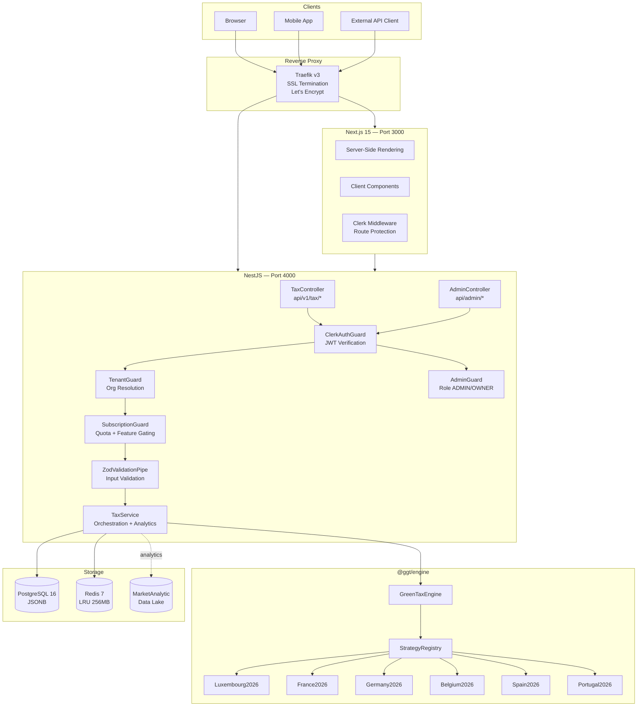
```mermaid
graph TB
    subgraph Clients
        Browser[Browser]
        Mobile[Mobile App]
        ExtAPI[External API Client]
    end

    subgraph Edge["Reverse Proxy"]
        Traefik[Traefik v3<br/>SSL Termination<br/>Let's Encrypt]
    end

    subgraph Frontend["Next.js 15 — Port 3000"]
        SSR[Server-Side Rendering]
        CSR[Client Components]
        CLERK_MW[Clerk Middleware<br/>Route Protection]
    end

    subgraph Backend["NestJS — Port 4000"]
        direction TB
        CTRL[TaxController<br/>api/v1/tax/*]
        AUTH_G[ClerkAuthGuard<br/>JWT Verification]
        TENANT_G[TenantGuard<br/>Org Resolution]
        SUB_G[SubscriptionGuard<br/>Quota + Feature Gating]
        ZOD_P[ZodValidationPipe<br/>Input Validation]
        SVC[TaxService<br/>Orchestration + Analytics]
        ADMIN_C[AdminController<br/>api/admin/*]
        ADMIN_G[AdminGuard<br/>Role ADMIN/OWNER]
    end

    subgraph EngineCore["@ggt/engine"]
        ENG[GreenTaxEngine]
        REG[StrategyRegistry]
        LU[Luxembourg2026]
        FR[France2026]
        DE[Germany2026]
        BE[Belgium2026]
        ES[Spain2026]
        PT[Portugal2026]
    end

    subgraph Storage
        PG[(PostgreSQL 16<br/>JSONB)]
        RD[(Redis 7<br/>LRU 256MB)]
        DL[(MarketAnalytic<br/>Data Lake)]
    end

    Browser --> Traefik
    Mobile --> Traefik
    ExtAPI --> Traefik
    Traefik --> Frontend
    Traefik --> Backend

    Frontend --> Backend
    CTRL --> AUTH_G --> TENANT_G --> SUB_G --> ZOD_P --> SVC
    ADMIN_C --> AUTH_G --> ADMIN_G
    SVC --> ENG
    SVC -.->|analytics| DL
    ENG --> REG --> LU & FR & DE & BE & ES & PT
    SVC --> PG
    SVC --> RD
```

---

## Economic Model

Global Green Tax follows a **4-tier SaaS subscription model** with a Freemium entry point designed to maximize top-of-funnel acquisition and conversion.

### Plan Comparison


```mermaid
graph TD
    subgraph Freemium["⚪ Freemium — 0 €"]
        F1["Target: Découverte"]
        F2["1 juridiction"]
        F3["3 simulations/mois"]
        F4["PDF/Deep Dive: bloqués (403)"]
        F5["1 utilisateur"]
    end

    subgraph Starter["🟢 Starter — 99 €/mois"]
        S1["Target: PME / SMEs"]
        S2["1 juridiction"]
        S3["5 simulations/mois"]
        S4["5 exports PDF/mois"]
        S5["2 utilisateurs"]
        S6["Support email"]
    end

    subgraph Professional["🔵 Professional — 499 €/mois"]
        P1["Target: Fiduciaires & Comptables"]
        P2["Toutes juridictions"]
        P3["Simulations illimitées"]
        P4["Export PDF illimité"]
        P5["Fiscal Deep Dive"]
        P6["10 utilisateurs"]
        P7["White-label: PDF & portail"]
        P8["API REST"]
        P9["Support prioritaire + chat"]
        P10["SLA 99.5%"]
    end

    subgraph Enterprise["🟡 Enterprise — Sur mesure"]
        E1["Target: Grands groupes"]
        E2["Toutes juridictions"]
        E3["Simulations illimitées"]
        E4["Fiscal Deep Dive"]
        E5["White-label complet"]
        E6["API REST + Webhooks + SDK"]
        E7["SSO SAML / OIDC"]
        E8["Déploiement On-Premise"]
        E9["Utilisateurs illimités"]
        E10["CSM dédié"]
        E11["SLA 99.9%"]
    end

    Freemium -->|"Conversion: PDF, Deep Dive"| Starter
    Starter -->|"Upsell: multi-pays, API"| Professional
    Professional -->|"Upsell: SSO, on-prem"| Enterprise
```

### Detailed Feature Matrix

| Feature | Freemium (0 €) | Starter (99 €/mois) | Professional (499 €/mois) | Enterprise (Custom) |
|---------|---------------|---------------------|---------------------------|---------------------|
| **Jurisdictions** | 1 pays | 1 pays | Tous les pays | Tous les pays |
| **Simulations** | 3 / mois | 5 / mois | Illimité | Illimité |
| **Export PDF** | Bloqué (403) | 5 / mois | Illimité | Illimité |
| **Fiscal Deep Dive** | Bloqué (403) | — | Complet | Complet |
| **Utilisateurs** | 1 siège | 2 sièges | 10 sièges | Illimité |
| **White-label** | — | — | PDF & portail brandé | White-label complet |
| **API Access** | — | — | REST API | REST + Webhooks + SDK |
| **SSO** | — | — | — | SAML / OIDC |
| **Support** | — | Email (48h) | Email + chat prioritaire | CSM dédié |
| **SLA** | — | — | 99.5% uptime | 99.9% + SLA custom |
| **Déploiement** | Cloud | Cloud | Cloud | Cloud / On-premise |
| **Historique** | 1 mois | 3 mois | 24 mois | Illimité |
| **Audit trail** | — | — | Logs d'accès | Logs complets + SIEM |

### Subscription Lifecycle

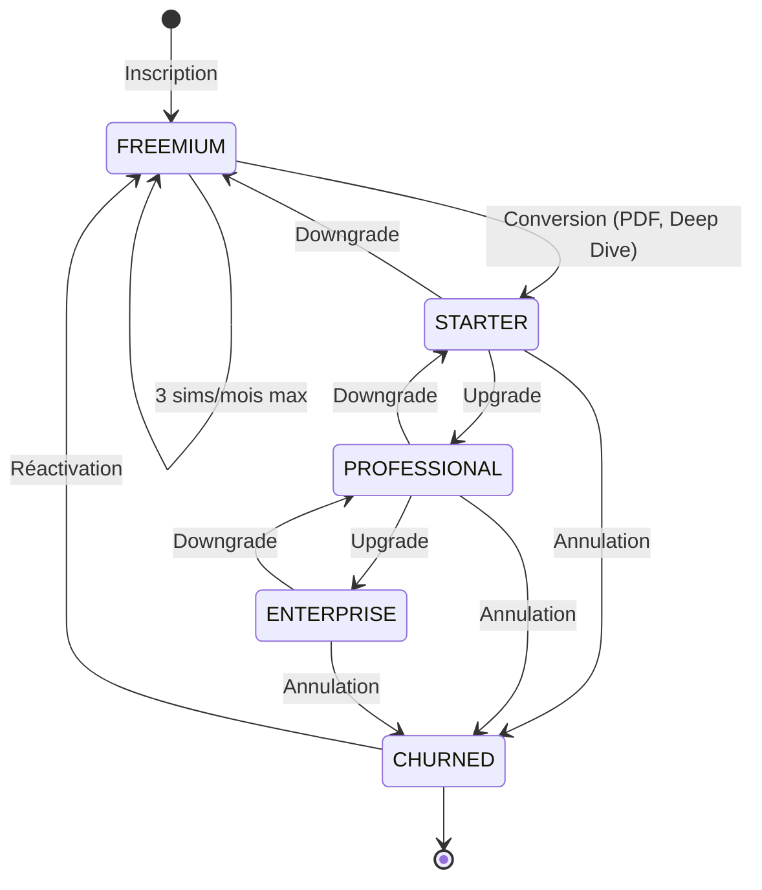
```mermaid
stateDiagram-v2
    [*] --> FREEMIUM: Inscription
    FREEMIUM --> STARTER: Conversion (PDF, Deep Dive)
    FREEMIUM --> FREEMIUM: 3 sims/mois max

    STARTER --> PROFESSIONAL: Upgrade
    STARTER --> FREEMIUM: Downgrade
    STARTER --> CHURNED: Annulation

    PROFESSIONAL --> ENTERPRISE: Upgrade
    PROFESSIONAL --> STARTER: Downgrade
    PROFESSIONAL --> CHURNED: Annulation

    ENTERPRISE --> PROFESSIONAL: Downgrade
    ENTERPRISE --> CHURNED: Annulation

    CHURNED --> FREEMIUM: Réactivation
    CHURNED --> [*]
```

### Quota Enforcement Architecture

The platform enforces subscription quotas via a `SubscriptionGuard` in the NestJS API pipeline:

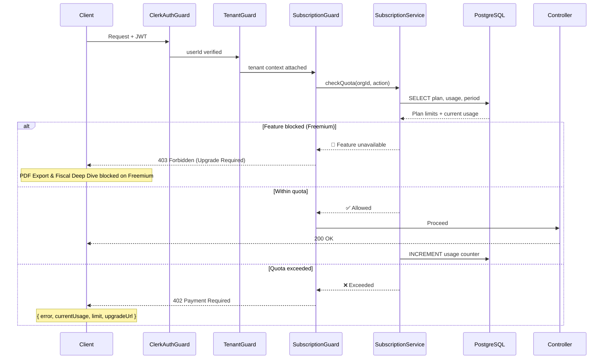
```mermaid
sequenceDiagram
    participant Client
    participant AuthGuard as ClerkAuthGuard
    participant TenantGuard
    participant SubGuard as SubscriptionGuard
    participant SubService as SubscriptionService
    participant DB as PostgreSQL
    participant Controller

    Client->>AuthGuard: Request + JWT
    AuthGuard->>TenantGuard: userId verified
    TenantGuard->>SubGuard: tenant context attached
    SubGuard->>SubService: checkQuota(orgId, action)
    SubService->>DB: SELECT plan, usage, period
    DB-->>SubService: Plan limits + current usage

    alt Feature blocked (Freemium)
        SubService-->>SubGuard: 🚫 Feature unavailable
        SubGuard-->>Client: 403 Forbidden (Upgrade Required)
        Note over Client: PDF Export & Fiscal Deep Dive blocked on Freemium
    else Within quota
        SubService-->>SubGuard: ✅ Allowed
        SubGuard->>Controller: Proceed
        Controller-->>Client: 200 OK
        SubService->>DB: INCREMENT usage counter
    else Quota exceeded
        SubService-->>SubGuard: ❌ Exceeded
        SubGuard-->>Client: 402 Payment Required
        Note over Client: { error, currentUsage, limit, upgradeUrl }
    end
```

### Revenue Model

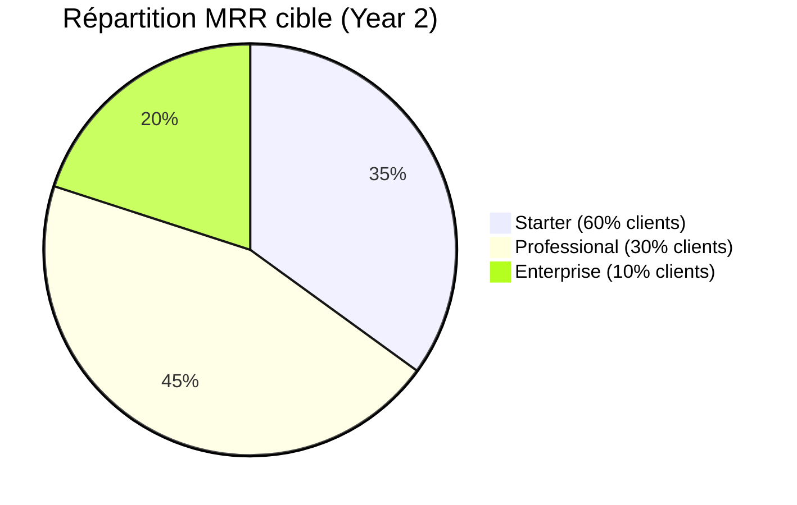
```mermaid
pie title Répartition MRR cible (Year 2)
    "Starter (60% clients)" : 35
    "Professional (30% clients)" : 45
    "Enterprise (10% clients)" : 20
```

| Metric | Target |
|--------|--------|
| **MRR per Starter** | 99 € |
| **MRR per Professional** | 499 € |
| **ACV Enterprise** | 15 000 – 50 000 € |
| **Taux de churn** | < 5% mensuel |
| **Ratio LTV/CAC** | > 3:1 |
| **Marge brute** | > 85% (pure SaaS) |
| **Conversion trial → paid** | > 15% |

---

## Monorepo Structure

The project uses **Turborepo** with npm workspaces for build orchestration:

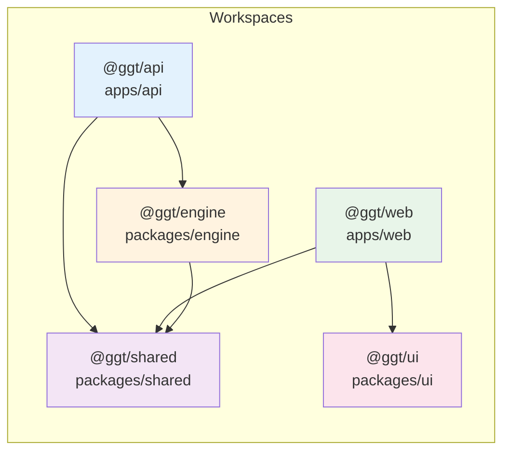
```mermaid
graph LR
    subgraph Workspaces
        direction TB
        API["@ggt/api<br/>apps/api"]
        WEB["@ggt/web<br/>apps/web"]
        ENGINE["@ggt/engine<br/>packages/engine"]
        SHARED["@ggt/shared<br/>packages/shared"]
        UI_PKG["@ggt/ui<br/>packages/ui"]
    end

    API --> ENGINE
    API --> SHARED
    WEB --> SHARED
    WEB --> UI_PKG
    ENGINE --> SHARED

    style API fill:#e3f2fd
    style WEB fill:#e8f5e9
    style ENGINE fill:#fff3e0
    style SHARED fill:#f3e5f5
    style UI_PKG fill:#fce4ec
```

### Turborepo Pipeline

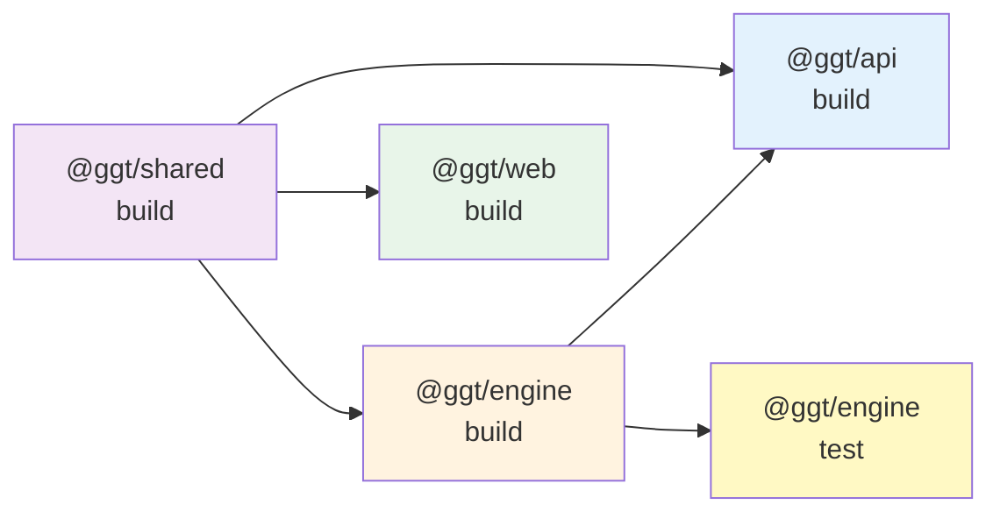
```mermaid
graph LR
    shared_build["@ggt/shared<br/>build"] --> engine_build["@ggt/engine<br/>build"]
    shared_build --> api_build["@ggt/api<br/>build"]
    shared_build --> web_build["@ggt/web<br/>build"]
    engine_build --> api_build

    engine_build --> test["@ggt/engine<br/>test"]

    style shared_build fill:#f3e5f5
    style engine_build fill:#fff3e0
    style api_build fill:#e3f2fd
    style web_build fill:#e8f5e9
    style test fill:#fff9c4
```

**Key packages:**

| Package | Role | Dependencies |
|---------|------|-------------|
| `@ggt/shared` | Types, Zod schemas, enums | None |
| `@ggt/engine` | Calculation engine, strategies | `@ggt/shared` |
| `@ggt/api` | REST API, auth, DB, cache | `@ggt/engine`, `@ggt/shared` |
| `@ggt/web` | Frontend, simulation UI, PDF | `@ggt/shared` |
| `@ggt/ui` | Shared UI utilities | None |

---

## Calculation Engine

The engine is a pure TypeScript package with zero framework dependencies. This enables it to run server-side (NestJS) and client-side (browser) identically.

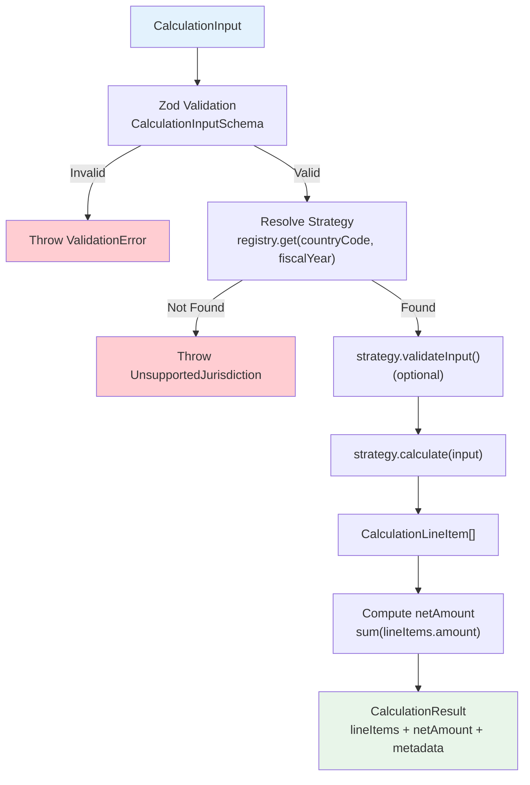
```mermaid
flowchart TD
    INPUT["CalculationInput"] --> VALIDATE["Zod Validation<br/>CalculationInputSchema"]
    VALIDATE -->|Invalid| ERROR["Throw ValidationError"]
    VALIDATE -->|Valid| RESOLVE["Resolve Strategy<br/>registry.get(countryCode, fiscalYear)"]
    RESOLVE -->|Not Found| ERROR2["Throw UnsupportedJurisdiction"]
    RESOLVE -->|Found| CUSTOM_VALIDATE["strategy.validateInput()<br/>(optional)"]
    CUSTOM_VALIDATE --> CALC["strategy.calculate(input)"]
    CALC --> ITEMS["CalculationLineItem[]"]
    ITEMS --> AGGREGATE["Compute netAmount<br/>sum(lineItems.amount)"]
    AGGREGATE --> RESULT["CalculationResult<br/>lineItems + netAmount + metadata"]

    style INPUT fill:#e3f2fd
    style RESULT fill:#e8f5e9
    style ERROR fill:#ffcdd2
    style ERROR2 fill:#ffcdd2
```

### Line Item Convention

Every calculation produces an array of `CalculationLineItem`:

| Field | Description |
|-------|-------------|
| `code` | Unique identifier (e.g., `FR-CCE-2026`) |
| `label` | Human-readable name |
| `amount` | **Positive** = subsidy/credit, **Negative** = tax/levy |
| `currency` | ISO 4217 code |
| `description` | Calculation breakdown |
| `legalReference` | Legal basis (optional) |

---

## Strategy Pattern

Each jurisdiction implements the `JurisdictionStrategy` interface:

```typescript
interface JurisdictionStrategy {
  readonly countryCode: string;
  readonly name: string;
  readonly fiscalYear: number;
  readonly currency: CurrencyCode;
  calculate(input: CalculationInput): Promise<CalculationLineItem[]>;
  validateInput?(input: CalculationInput): void;
}
```

### Strategy Registry

Strategies are stored in a map keyed by `{countryCode}:{fiscalYear}`:

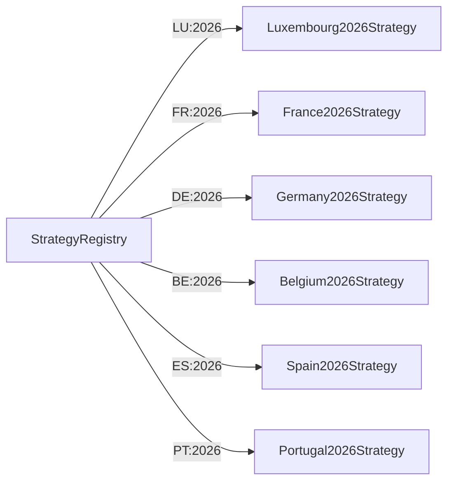
```mermaid
flowchart LR
    REG["StrategyRegistry"]
    REG -->|"LU:2026"| LU["Luxembourg2026Strategy"]
    REG -->|"FR:2026"| FR["France2026Strategy"]
    REG -->|"DE:2026"| DE["Germany2026Strategy"]
    REG -->|"BE:2026"| BE["Belgium2026Strategy"]
    REG -->|"ES:2026"| ES["Spain2026Strategy"]
    REG -->|"PT:2026"| PT["Portugal2026Strategy"]
```

### Luxembourg 2026 Calculation Flow

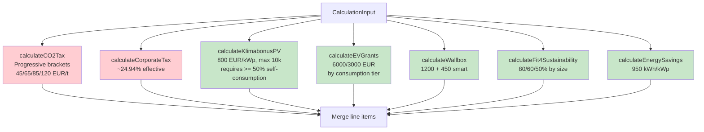
```mermaid
flowchart TD
    INPUT[CalculationInput] --> CO2["calculateCO2Tax<br/>Progressive brackets<br/>45/65/85/120 EUR/t"]
    INPUT --> CORP["calculateCorporateTax<br/>~24.94% effective"]
    INPUT --> PV["calculateKlimabonusPV<br/>800 EUR/kWp, max 10k<br/>requires >= 50% self-consumption"]
    INPUT --> EV["calculateEVGrants<br/>6000/3000 EUR<br/>by consumption tier"]
    INPUT --> WB["calculateWallbox<br/>1200 + 450 smart"]
    INPUT --> F4S["calculateFit4Sustainability<br/>80/60/50% by size"]
    INPUT --> EN["calculateEnergySavings<br/>950 kWh/kWp"]

    CO2 --> MERGE["Merge line items"]
    CORP --> MERGE
    PV --> MERGE
    EV --> MERGE
    WB --> MERGE
    F4S --> MERGE
    EN --> MERGE

    style CO2 fill:#ffcdd2
    style CORP fill:#ffcdd2
    style PV fill:#c8e6c9
    style EV fill:#c8e6c9
    style WB fill:#c8e6c9
    style F4S fill:#c8e6c9
    style EN fill:#c8e6c9
```

### France 2026 Calculation Flow

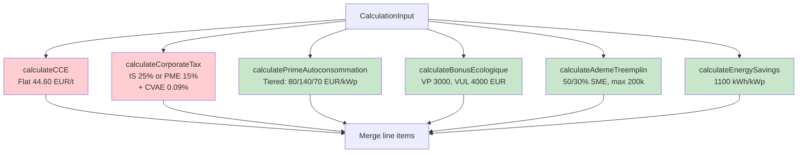
```mermaid
flowchart TD
    INPUT[CalculationInput] --> CCE["calculateCCE<br/>Flat 44.60 EUR/t"]
    INPUT --> IS["calculateCorporateTax<br/>IS 25% or PME 15%<br/>+ CVAE 0.09%"]
    INPUT --> PVFR["calculatePrimeAutoconsommation<br/>Tiered: 80/140/70 EUR/kWp"]
    INPUT --> BONUS["calculateBonusEcologique<br/>VP 3000, VUL 4000 EUR"]
    INPUT --> ADEME["calculateAdemeTreemplin<br/>50/30% SME, max 200k"]
    INPUT --> ENFR["calculateEnergySavings<br/>1100 kWh/kWp"]

    CCE --> MERGE["Merge line items"]
    IS --> MERGE
    PVFR --> MERGE
    BONUS --> MERGE
    ADEME --> MERGE
    ENFR --> MERGE

    style CCE fill:#ffcdd2
    style IS fill:#ffcdd2
    style PVFR fill:#c8e6c9
    style BONUS fill:#c8e6c9
    style ADEME fill:#c8e6c9
    style ENFR fill:#c8e6c9
```

### Enterprise Size Classification

Both strategies classify organizations by size, affecting subsidy rates:

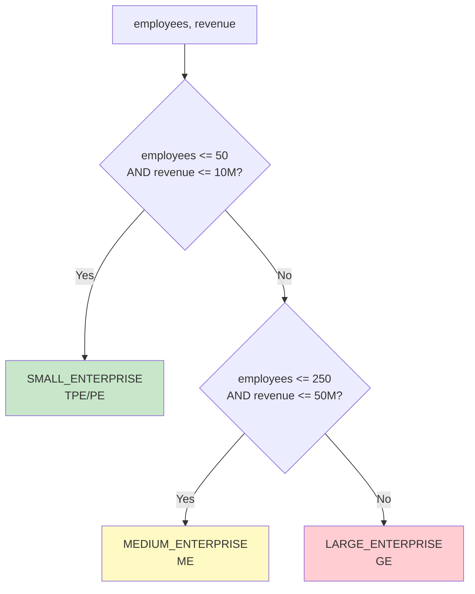
```mermaid
graph TD
    INPUT["employees, revenue"] --> CHECK1{"employees <= 50<br/>AND revenue <= 10M?"}
    CHECK1 -->|Yes| SMALL["SMALL_ENTERPRISE<br/>TPE/PE"]
    CHECK1 -->|No| CHECK2{"employees <= 250<br/>AND revenue <= 50M?"}
    CHECK2 -->|Yes| MEDIUM["MEDIUM_ENTERPRISE<br/>ME"]
    CHECK2 -->|No| LARGE["LARGE_ENTERPRISE<br/>GE"]

    style SMALL fill:#c8e6c9
    style MEDIUM fill:#fff9c4
    style LARGE fill:#ffcdd2
```

---

## Data Flow

### Calculation Pipeline (Server-Side)

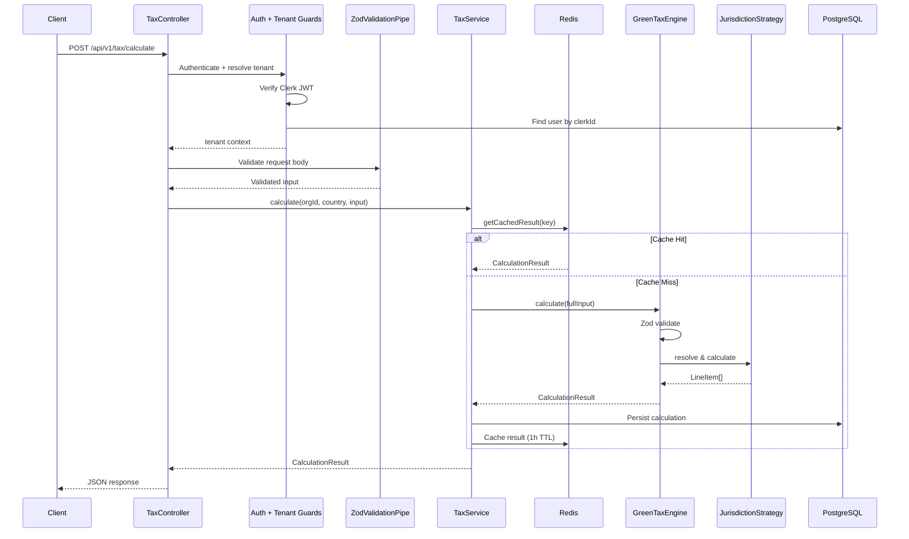
```mermaid
sequenceDiagram
    participant Client
    participant Controller as TaxController
    participant Guard as Auth + Tenant Guards
    participant Zod as ZodValidationPipe
    participant Service as TaxService
    participant Cache as Redis
    participant Engine as GreenTaxEngine
    participant Strategy as JurisdictionStrategy
    participant DB as PostgreSQL

    Client->>Controller: POST /api/v1/tax/calculate
    Controller->>Guard: Authenticate + resolve tenant
    Guard->>Guard: Verify Clerk JWT
    Guard->>DB: Find user by clerkId
    Guard-->>Controller: tenant context
    Controller->>Zod: Validate request body
    Zod-->>Controller: Validated input
    Controller->>Service: calculate(orgId, country, input)
    Service->>Cache: getCachedResult(key)
    alt Cache Hit
        Cache-->>Service: CalculationResult
    else Cache Miss
        Service->>Engine: calculate(fullInput)
        Engine->>Engine: Zod validate
        Engine->>Strategy: resolve & calculate
        Strategy-->>Engine: LineItem[]
        Engine-->>Service: CalculationResult
        Service->>DB: Persist calculation
        Service->>Cache: Cache result (1h TTL)
    end
    Service-->>Controller: CalculationResult
    Controller-->>Client: JSON response
```

---

## Multi-Tenancy

The application implements **row-level multi-tenancy** through the `TenantGuard`:

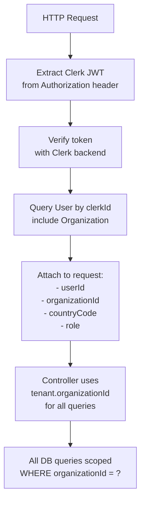
```mermaid
flowchart TD
    REQ[HTTP Request] --> JWT["Extract Clerk JWT<br/>from Authorization header"]
    JWT --> VERIFY["Verify token<br/>with Clerk backend"]
    VERIFY --> LOOKUP["Query User by clerkId<br/>include Organization"]
    LOOKUP --> ATTACH["Attach to request:<br/>- userId<br/>- organizationId<br/>- countryCode<br/>- role"]
    ATTACH --> CTRL["Controller uses<br/>tenant.organizationId<br/>for all queries"]

    CTRL --> DB["All DB queries scoped<br/>WHERE organizationId = ?"]
```

### Role-Based Access

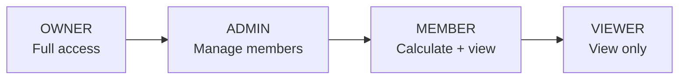
```mermaid
graph LR
    OWNER["OWNER<br/>Full access"] --> ADMIN["ADMIN<br/>Manage members"]
    ADMIN --> MEMBER["MEMBER<br/>Calculate + view"]
    MEMBER --> VIEWER["VIEWER<br/>View only"]
```

---

## Subscription & Quota Management

The `SubscriptionModule` manages plan assignments, usage tracking, and quota enforcement for all organizations.

### Data Model

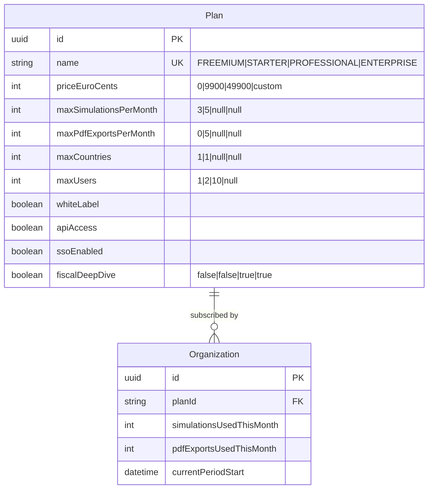
```mermaid
erDiagram
    Plan ||--o{ Organization : "subscribed by"

    Plan {
        uuid id PK
        string name UK "FREEMIUM|STARTER|PROFESSIONAL|ENTERPRISE"
        int priceEuroCents "0|9900|49900|custom"
        int maxSimulationsPerMonth "3|5|null|null"
        int maxPdfExportsPerMonth "0|5|null|null"
        int maxCountries "1|1|null|null"
        int maxUsers "1|2|10|null"
        boolean whiteLabel
        boolean apiAccess
        boolean ssoEnabled
        boolean fiscalDeepDive "false|false|true|true"
    }

    Organization {
        uuid id PK
        string planId FK
        int simulationsUsedThisMonth
        int pdfExportsUsedThisMonth
        datetime currentPeriodStart
    }
```

### SubscriptionService API

```typescript
class SubscriptionService {
  // Query
  getOrganizationPlan(orgId: string): Promise<PlanWithUsage>

  // Quota checks (called by guard)
  checkSimulationQuota(orgId: string): Promise<QuotaCheckResult>
  checkPdfExportQuota(orgId: string): Promise<QuotaCheckResult>

  // Feature gating (Freemium → 403 Forbidden)
  assertPdfExportAllowed(orgId: string): Promise<void>     // throws 403 if limit === 0
  assertFiscalDeepDiveAllowed(orgId: string): Promise<void> // throws 403 if !fiscalDeepDive

  // Usage tracking (called after successful action)
  incrementSimulationUsage(orgId: string): Promise<void>
  incrementPdfExportUsage(orgId: string): Promise<void>

  // Plan management
  changePlan(orgId: string, planName: string): Promise<Organization>
  resetMonthlyUsage(): Promise<void>  // CRON: 1st of each month
}
```

### Freemium Feature Gating

The FREEMIUM plan (Tier 0) has access to basic simulations but blocks premium features:

| Feature | Freemium Behavior | HTTP Status |
|---------|-------------------|-------------|
| **Simulations** | 3/month allowed | 402 when exceeded |
| **PDF Export** | Completely blocked | 403 Forbidden |
| **Fiscal Deep Dive** | Completely blocked | 403 Forbidden |

The distinction between 402 (quota exceeded) and 403 (feature not available) helps the frontend display appropriate upgrade prompts.

### Quota Reset Flow

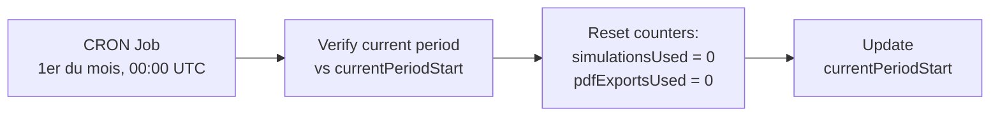
```mermaid
flowchart LR
    CRON["CRON Job<br/>1er du mois, 00:00 UTC"] --> CHECK["Verify current period<br/>vs currentPeriodStart"]
    CHECK --> RESET["Reset counters:<br/>simulationsUsed = 0<br/>pdfExportsUsed = 0"]
    RESET --> UPDATE["Update<br/>currentPeriodStart"]
```

---

## MarketAnalytic Data Lake

Every tax simulation automatically ingests structured analytics into the `MarketAnalytic` table. This creates a growing data lake of green investment intelligence across all jurisdictions.

### Data Model

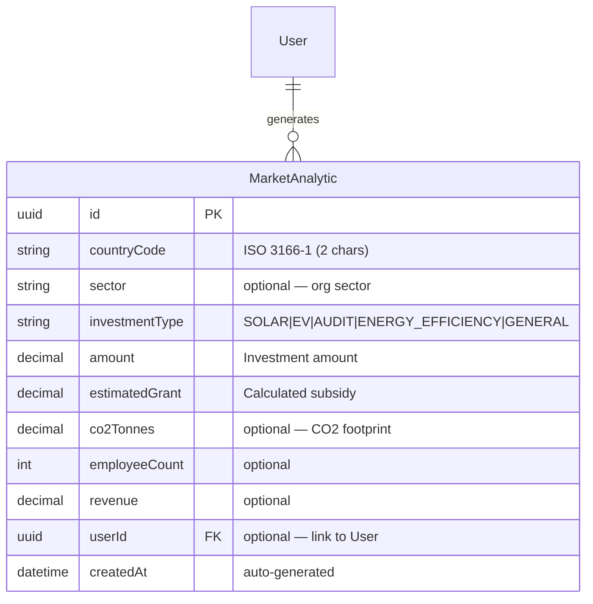
```mermaid
erDiagram
    User ||--o{ MarketAnalytic : "generates"

    MarketAnalytic {
        uuid id PK
        string countryCode "ISO 3166-1 (2 chars)"
        string sector "optional — org sector"
        string investmentType "SOLAR|EV|AUDIT|ENERGY_EFFICIENCY|GENERAL"
        decimal amount "Investment amount"
        decimal estimatedGrant "Calculated subsidy"
        decimal co2Tonnes "optional — CO2 footprint"
        int employeeCount "optional"
        decimal revenue "optional"
        uuid userId FK "optional — link to User"
        datetime createdAt "auto-generated"
    }
```

**Indexes:** `countryCode`, `investmentType`, `createdAt`, `sector` — optimized for aggregation queries.

### Analytics Ingestion Flow

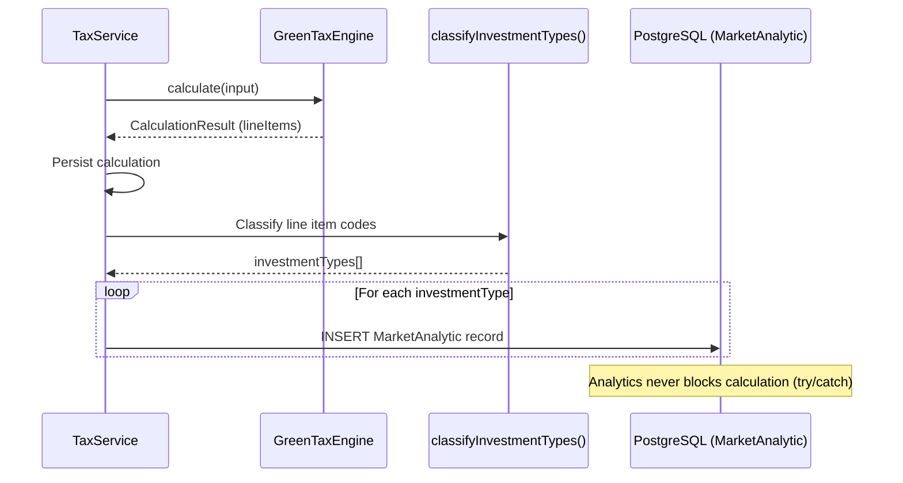
```mermaid
sequenceDiagram
    participant TaxService
    participant Engine as GreenTaxEngine
    participant Classifier as classifyInvestmentTypes()
    participant DB as PostgreSQL (MarketAnalytic)

    TaxService->>Engine: calculate(input)
    Engine-->>TaxService: CalculationResult (lineItems)
    TaxService->>TaxService: Persist calculation
    TaxService->>Classifier: Classify line item codes
    Classifier-->>TaxService: investmentTypes[]
    loop For each investmentType
        TaxService->>DB: INSERT MarketAnalytic record
    end
    Note over DB: Analytics never blocks calculation (try/catch)
```

### Investment Type Classification

The `classifyInvestmentTypes()` method uses pattern matching on line item codes:

| Type | Matched Code Patterns |
|------|----------------------|
| `SOLAR` | PV, SOLAR, KFW, EDIFICIO |
| `EV` | EV, MOVES, BONUS-ECO, UMWELT, FLEET, VE |
| `AUDIT` | F4S, ADEME, BAFA, AMURE, AUDIT, IAPMEI |
| `ENERGY_EFFICIENCY` | ENERGY, IBI, ECOPREMIE |
| `GENERAL` | Fallback when no pattern matches |

---

## Admin Module

The Admin module provides a protected dashboard and API for platform operators to monitor KPIs, manage users, and change subscription plans.

### Architecture

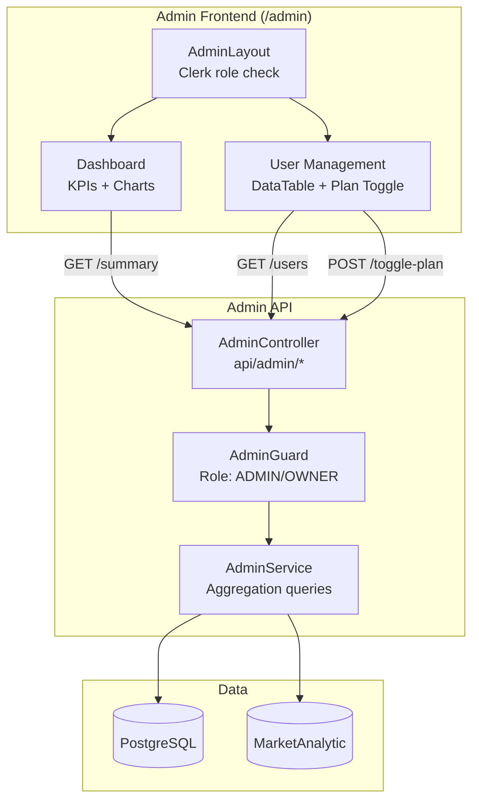
```mermaid
graph TB
    subgraph Frontend["Admin Frontend (/admin)"]
        LAYOUT[AdminLayout<br/>Clerk role check]
        DASH[Dashboard<br/>KPIs + Charts]
        USERS[User Management<br/>DataTable + Plan Toggle]
    end

    subgraph API["Admin API"]
        CTRL[AdminController<br/>api/admin/*]
        GUARD[AdminGuard<br/>Role: ADMIN/OWNER]
        SVC[AdminService<br/>Aggregation queries]
    end

    subgraph Data
        PG[(PostgreSQL)]
        DL[(MarketAnalytic)]
    end

    LAYOUT --> DASH & USERS
    DASH -->|GET /summary| CTRL
    USERS -->|GET /users| CTRL
    USERS -->|POST /toggle-plan| CTRL
    CTRL --> GUARD --> SVC
    SVC --> PG & DL
```

### Admin API Endpoints

| Method | Endpoint | Description | Guard |
|--------|----------|-------------|-------|
| `GET` | `/api/admin/analytics/summary` | Dashboard KPIs, trends, aggregations | ClerkAuth + Admin |
| `GET` | `/api/admin/users` | Paginated user list with search | ClerkAuth + Admin |
| `POST` | `/api/admin/users/:id/toggle-plan` | Change user's org plan | ClerkAuth + Admin |

### AdminGuard

The `AdminGuard` verifies the requesting user has an `ADMIN` or `OWNER` role in the database:

```mermaid
flowchart TD
    REQ[Request] --> JWT["Extract clerkId<br/>from JWT"]
    JWT --> LOOKUP["Query User by clerkId"]
    LOOKUP --> CHECK{"role === ADMIN<br/>or OWNER?"}
    CHECK -->|Yes| ATTACH["Attach adminUser context"]
    ATTACH --> CTRL["Proceed to controller"]
    CHECK -->|No| DENY["403 Forbidden"]
```

### Dashboard KPIs

The `AdminService.getSummary()` aggregates data via 10 parallel queries:

| KPI | Source |
|-----|--------|
| Total users | `User.count()` |
| Total organizations | `Organization.count()` |
| Total simulations | `Calculation.count()` |
| Data lake entries | `MarketAnalytic.count()` |
| Organizations by plan | `Organization.groupBy(planId)` |
| Estimated MRR | `sum(plan.price * org.count)` |
| Simulations (30 days) | `Calculation.count(createdAt >= -30d)` |
| Top countries | `MarketAnalytic.groupBy(countryCode)` |
| Top investment types | `MarketAnalytic.groupBy(investmentType)` |
| 30-day simulation trend | Raw SQL: `GROUP BY DATE(created_at)` |

### Admin Frontend

| View | Component | Features |
|------|-----------|----------|
| **Dashboard** | `admin/page.tsx` | 4 KPI cards, AreaChart (30d trend), PieChart (plan distribution), BarChart (investment types), country progress bars |
| **Users** | `admin/users/page.tsx` | Searchable DataTable, plan badge colors, role indicators, plan change dropdown per row |

---

## AI/ML Pipeline

The platform includes an AI-readiness pipeline that exports the MarketAnalytic data lake to JSONL format for fine-tuning language models on green tax advisory.

### Export Script

```bash
npx tsx scripts/export-analytics.ts --output analytics.jsonl --limit 10000 --batch-size 500
```

### JSONL Record Format

Each record produces a structured prompt/completion pair:

```json
{
  "prompt": "Green tax analysis for country FR, sector MANUFACTURING, investment SOLAR, amount 150000 EUR",
  "completion": "Estimated grant: 12000 EUR. Investment type: SOLAR. CO2 impact: 45.2 tonnes.",
  "metadata": {
    "id": "uuid",
    "countryCode": "FR",
    "sector": "MANUFACTURING",
    "investmentType": "SOLAR",
    "amount": 150000,
    "estimatedGrant": 12000,
    "co2Tonnes": 45.2,
    "createdAt": "2026-02-10T10:00:00Z"
  }
}
```

### Pipeline Architecture

```mermaid
flowchart LR
    SIM["Tax Simulations"] -->|automatic| DL["MarketAnalytic<br/>Data Lake"]
    DL -->|batch export| JSONL["analytics.jsonl"]
    JSONL -->|fine-tuning| MODEL["LLM Fine-tune<br/>OpenAI / Vertex AI"]
    MODEL -->|inference| ADVISOR["Green Tax<br/>AI Advisor"]

    style SIM fill:#e8f5e9
    style DL fill:#e3f2fd
    style JSONL fill:#fff3e0
    style MODEL fill:#f3e5f5
    style ADVISOR fill:#fce4ec
```

The export uses cursor-based pagination with configurable batch sizes to handle large datasets without memory issues.

---

## Caching Strategy

```mermaid
flowchart LR
    KEY["Cache Key Format:<br/>calc:{orgId}:{country}:{year}"]
    TTL["TTL: 3600s (1 hour)"]
    EVICT["Eviction: allkeys-lru"]
    MAX["Max Memory: 256MB"]

    KEY --- TTL --- EVICT --- MAX
```

The `RedisService` provides:
- `buildCacheKey(orgId, countryCode, fiscalYear)` - Deterministic key generation
- `cacheResult(key, value, ttl)` - Store with TTL
- `getCachedResult<T>(key)` - Retrieve typed result
- `invalidate(key)` - Manual cache bust

---

## Client-Side Engine

The frontend includes a **mirror calculation engine** (`engine-client.ts`) that runs entirely in the browser for instant UI feedback:

```mermaid
flowchart LR
    SLIDER["User adjusts slider"] --> MEMO["useMemo triggers"]
    MEMO --> DISPATCH["simulateLocally(params)"]
    DISPATCH -->|"LU"| LU_CLIENT["simulateLuxembourg()"]
    DISPATCH -->|"FR"| FR_CLIENT["simulateFrance()"]
    DISPATCH -->|"DE"| DE_CLIENT["simulateGermany()"]
    DISPATCH -->|"BE"| BE_CLIENT["simulateBelgium()"]
    DISPATCH -->|"ES"| ES_CLIENT["simulateSpain()"]
    DISPATCH -->|"PT"| PT_CLIENT["simulatePortugal()"]
    LU_CLIENT & FR_CLIENT & DE_CLIENT & BE_CLIENT & ES_CLIENT & PT_CLIENT --> ITEMS["LineItem[]"]
    ITEMS --> CARD["ResultCard renders<br/>instantly"]
```

This dual-engine approach provides:
- **Zero latency** during parameter adjustment
- **No API calls** needed for preview
- **Identical logic** to server-side engine
- Server-side engine is the **source of truth** for persistence

---

## PDF Report Generation

```mermaid
flowchart TD
    CLICK["User clicks<br/>Exporter PDF"] --> DYNAMIC["Dynamic import<br/>@react-pdf/renderer"]
    DYNAMIC --> BRANDING["Load country branding<br/>colors, flag, labels"]
    BRANDING --> BUILD["Build ReportData<br/>lineItems + params"]
    BUILD --> RENDER["Render GreenTaxReport<br/>React PDF Document"]
    RENDER --> PAGE1["Page 1:<br/>Header + Summary +<br/>Line Items Table"]
    RENDER --> PAGE2["Page 2:<br/>ROI Projection +<br/>SVG Chart +<br/>Key Insights"]
    PAGE1 --> BLOB["Generate PDF blob"]
    PAGE2 --> BLOB
    BLOB --> DOWNLOAD["Trigger browser download<br/>rapport-fiscal-vert-XX-YYYY.pdf"]
```

### Country Branding

| Element | Luxembourg | France | Germany | Belgium | Spain | Portugal |
|---------|-----------|--------|---------|---------|-------|----------|
| Header BG | `#1A4D8F` | `#002395` | `#000000` | `#000000` | `#AA151B` | `#006600` |
| Accent | `#D71A28` | `#ED2939` | `#DD0000` | `#FDDA24` | `#F1BF00` | `#FF0000` |
| Tax color | `#D71A28` | `#ED2939` | `#DD0000` | `#DD0000` | `#AA151B` | `#FF0000` |
| Subsidy color | `#1A8D5F` | `#1A8D5F` | `#1A8D5F` | `#1A8D5F` | `#1A8D5F` | `#1A8D5F` |

---

## Adding a New Jurisdiction

### Step-by-step walkthrough

#### 1. Create the data schema

Copy `data/schemas/_template.json` as `{CODE}-{YEAR}.json`:

```json
{
  "metadata": {
    "countryCode": "DE",
    "countryName": "Germany",
    "fiscalYear": 2026,
    "currency": "EUR",
    "lastUpdated": "2026-01-01"
  },
  "taxRules": { ... },
  "subsidies": { ... },
  "energyRates": { ... }
}
```

#### 2. Create the strategy class

Create `packages/engine/src/strategies/germany-2026.ts`:

```typescript
import type { CalculationInput, CalculationLineItem } from '@ggt/shared';
import type { JurisdictionStrategy } from '../jurisdiction-strategy';

export class Germany2026Strategy implements JurisdictionStrategy {
  readonly countryCode = 'DE';
  readonly name = 'Germany 2026';
  readonly fiscalYear = 2026;
  readonly currency = 'EUR' as const;

  async calculate(input: CalculationInput): Promise<CalculationLineItem[]> {
    const items: CalculationLineItem[] = [];
    // Implement German-specific calculations
    return items;
  }
}
```

#### 3. Register the strategy

Update `packages/engine/src/index.ts`:

```typescript
export { Germany2026Strategy } from './strategies/germany-2026';
```

Update `apps/api/src/modules/tax/tax.service.ts`:

```typescript
registry.register(new Germany2026Strategy());
```

#### 4. Add client-side engine

Update `apps/web/src/lib/engine-client.ts`:

```typescript
export type CountryCode = 'LU' | 'FR' | 'DE';

// In simulateLocally():
case 'DE': return simulateGermany(params);
```

#### 5. Update frontend & branding

Add to `COUNTRIES` array in `page.tsx`, add branding in `pdf/country-branding.ts`.

#### 6. Update seed & tests

- Add data loading in `apps/api/prisma/seed.ts`
- Create test suite in `packages/engine/src/__tests__/germany-2026.test.ts`

### Verification checklist

```mermaid
flowchart LR
    A["JSON schema<br/>created"] --> B["Strategy class<br/>implements interface"]
    B --> C["Engine exports<br/>updated"]
    C --> D["API registry<br/>registers strategy"]
    D --> E["Client engine<br/>dispatches"]
    E --> F["Frontend UI<br/>shows country"]
    F --> G["PDF branding<br/>configured"]
    G --> H["Tests pass"]
    H --> I["Seed updated"]
```
